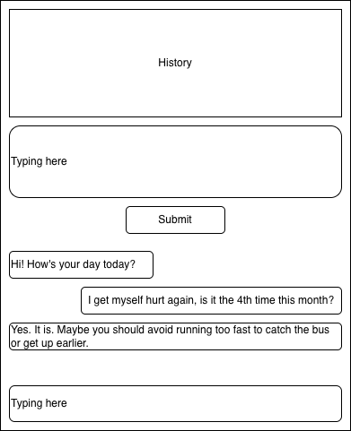

# CallItADay

A diary and chat application that helps you reflect on your day with AI-powered memory retrieval and conversation.



## Features

- **Diary History**: Write and view your daily entries with infinite scroll
- **Smart Embeddings**: Diary entries are automatically embedded and stored in ChromaDB for semantic search
- **AI Chat**: Chat with an AI companion that remembers your past entries and can retrieve relevant memories
- **Two-Turn Agent Architecture**: Efficient intent classification before tool execution
- **Independent "Soul"**: System prompts are editable files, allowing personality customization without code changes

## Architecture

```
┌─────────────────┐     ┌──────────────────┐     ┌─────────────────┐
│   React Frontend │────▶│   FastAPI        │────▶│   PostgreSQL    │
│   (Port 3000)   │     │   Backend        │     │   (Data)        │
└─────────────────┘     │   (Port 8080)    │     └─────────────────┘
                        │                  │
                        │  ┌────────────┐  │     ┌─────────────────┐
                        │  │ LangGraph  │  │────▶│   ChromaDB      │
                        │  │  Agents    │  │     │   (Vectors)     │
                        │  └────────────┘  │     │   Sparse+Dense  │
                        │                  │     └─────────────────┘
                        │  ┌────────────┐  │
                        │  │ LangChain  │  │────▶ AWS Bedrock
                        │  │  Tools     │  │      (Llama/Mistral)
                        │  └────────────┘  │
                        │                  │
                        │  ┌────────────┐  │
                        │  │   Soul     │  │◄──── system_prompts/
                        │  │  Config    │  │      (independent)
                        │  └────────────┘  │
                        └──────────────────┘
```

## Tech Stack

| Component | Technology |
|-----------|------------|
| Frontend | React + Vite + TypeScript |
| Backend | FastAPI + SQLAlchemy |
| Agent Framework | LangChain + LangGraph |
| Database | PostgreSQL |
| Vector Store | ChromaDB (sparse + dense embeddings) |
| Embeddings | sentence-transformers (local) |
| LLM | AWS Bedrock (Llama 3 / Mistral) |

## Data Flow

### Turn 1: Intent Detection
```
Input: User message + Chat history + Agent Summary
       (Agent Summary contains: diary count, recent topics, mood, etc.)
       
Prompt: Given the conversation and summary, do you need detailed tools?
        Reply with: { "needs_tools": true/false, "tool_name": "..." or null }
        
Output: Simple JSON decision - NO detailed tool specs yet
```

### Branch A: Direct Response (if no tools needed)
```
Input: User message + Chat history + Soul System Prompt
LLM Call: Single turn
Output: Direct response to user
```

### Branch B: Tool Execution (if tools needed)
```
Step 1: Inject detailed tool specifications into context
        - Tool name, description, parameters, examples
        
Step 2: LLM generates tool call with specific parameters
        - e.g., memory_search(query="running injury", limit=5)
        
Step 3: Execute tool, get results

Step 4: Final LLM call with results
        Input: User message + Chat history + Tool results + Soul System Prompt
        Output: Response to user incorporating tool results
```

## Project Structure

```
callItADay/
├── docker-compose.yml          # Orchestrates all services
├── .env.example                # AWS credentials template
├── backend/
│   ├── main.py                 # FastAPI endpoints
│   ├── models.py               # SQLAlchemy models
│   ├── embeddings.py           # ChromaDB integration
│   ├── agents/
│   │   ├── workflow.py         # Two-turn chat workflow
│   │   ├── intent_classifier.py # Turn 1: classify intent
│   │   └── summary_builder.py  # Agent summary generator
│   ├── tools/
│   │   ├── memory_tools.py     # ChromaDB search/add
│   │   └── diary_tools.py      # PostgreSQL diary queries
│   ├── llm/
│   │   ├── bedrock_client.py   # AWS Bedrock (Llama/Mistral)
│   │   └── prompt_loader.py    # Soul configuration loader
│   └── soul/                   # THE SOUL - independent & editable
│       ├── system_prompt.txt   # Main personality
│       ├── intent_prompt.txt   # Intent classification
│       └── tool_specs/         # Detailed tool schemas
│           ├── memory_search.json
│           ├── memory_add.json
│           └── diary_retrieve.json
└── frontend/
    └── src/
        ├── App.tsx
        ├── components/
        │   ├── DiarySection.tsx
        │   └── ChatSection.tsx
        └── hooks/
            └── useInfiniteScroll.ts
```

## Quick Start

### Prerequisites

- Docker and Docker Compose
- AWS account with Bedrock access
- AWS credentials (Access Key ID and Secret Access Key)

### 1. Clone and Configure

```bash
git clone <repository-url>
cd callItADay

# Copy the example environment file
cp .env.example .env

# Edit .env with your AWS credentials
# Available models:
# - meta.llama3-70b-instruct-v1:0 (default, recommended)
# - meta.llama3-8b-instruct-v1:0 (faster, cheaper)
# - mistral.mistral-large-2402-v1:0
# - mistral.mixtral-8x7b-instruct-v0:1
```

### 2. Start Services

```bash
docker-compose up --build
```

### 3. Access the Application

- **Frontend**: http://localhost:3000
- **Backend API**: http://localhost:8080
- **API Documentation**: http://localhost:8080/docs

## The "Soul" - Customizing the AI Personality

The personality and behavior of the AI companion can be customized by editing files in `backend/soul/`:

### system_prompt.txt
Main personality and response style:
```
You are a thoughtful and empathetic diary companion. Your role is to:
1. Listen attentively to the user's thoughts and experiences
2. Offer gentle, supportive responses
3. Help them reflect on their day and patterns in their life
...
```

### intent_prompt.txt
Guidelines for when to use tools vs direct response.

### tool_specs/
JSON schemas for each tool that can be called.

**Note**: After editing these files, restart the backend container:
```bash
docker-compose restart backend
```

## Available Tools

| Tool | Description | When Used |
|------|-------------|-----------|
| `memory_search` | Semantic search through diary entries and memories | User asks about past events, patterns, or history |
| `memory_add` | Save important information for long-term retrieval | User shares facts worth remembering (birthdays, preferences, etc.) |
| `diary_retrieve` | Get specific diary entries by date or recent entries | User references specific dates or asks about recent entries |

## API Endpoints

### Diary Endpoints
- `POST /api/diaries` - Create a new diary entry
- `GET /api/diaries` - List diary entries (paginated)
- `GET /api/diaries/search?query={query}` - Search entries semantically

### Chat Endpoints
- `POST /api/chat` - Send a message and get AI response
- `GET /api/chat` - List chat messages (paginated)

## Environment Variables

| Variable | Description | Default |
|----------|-------------|---------|
| `AWS_REGION` | AWS region for Bedrock | `us-east-1` |
| `AWS_ACCESS_KEY_ID` | Your AWS access key | - |
| `AWS_SECRET_ACCESS_KEY` | Your AWS secret key | - |
| `LLM_MODEL_ID` | Bedrock model ID | `meta.llama3-70b-instruct-v1:0` |

## Development

### Running Backend Locally

```bash
cd backend
python -m venv venv
source venv/bin/activate  # On Windows: venv\Scripts\activate
pip install -r requirements.txt
uvicorn main:app --reload --port 8080
```

### Running Frontend Locally

```bash
cd frontend
npm install
npm run dev
```

## License

MIT
